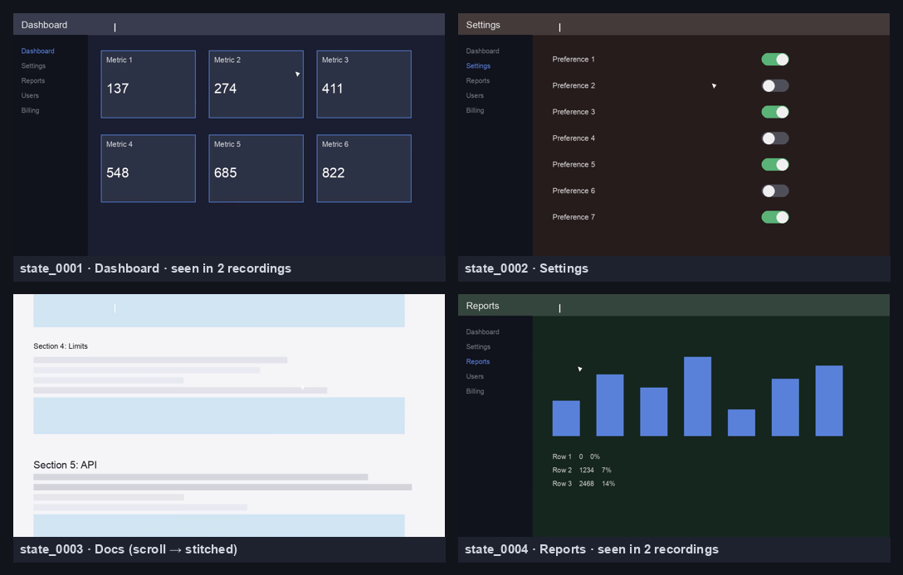
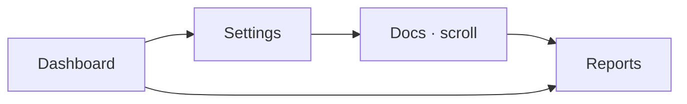
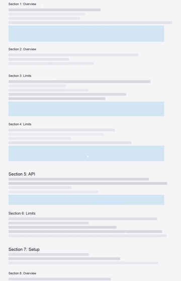
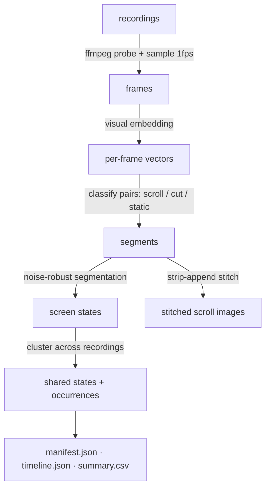

<div align="center">

# 🎞️ Screenline

**Turn screen recordings into a structured visual timeline and project knowledge base for LLMs.**

[](https://github.com/Forne14/Screenline/actions/workflows/ci.yml)
[](https://www.python.org/)
[](LICENSE)
[](CHANGELOG.md)
[](#contributing)
[](#)

<em>Most meeting tools focus on transcripts. Screenline focuses on what's <strong>on screen</strong>.</em>



<sub>Four screen states automatically extracted from two recordings — Dashboard & Reports
recognised as the <strong>same screens across both videos</strong>, the docs page captured as a
single <strong>stitched scroll image</strong>.</sub>

</div>

---

## Why Screenline?

The most valuable information in a product demo, design review or prototype
walkthrough is usually **what is visible on screen**, not what is said.
Screenline is a **local-first CLI** that extracts and preserves that visual
context: point it at recordings and it produces a curated set of **screen
states**, **transitions** and **stitched scrolling captures** — the visual source
material an LLM (or a human) can use to understand a product without watching
hours of video.

> Screenline does **not** generate summaries. It generates the visual knowledge
> from which summaries, specs and tasks can later be created.

## ✨ Features

- 🧠 **Thinks in screen states, not frames.** A *screen state* is "a screen that
  conveys meaningfully different information to a human observer." Mouse moves,
  hover, spinners, caret blinks and toasts **never** create a state.
- 📜 **Detects & stitches scrolling.** Long pages (docs, dashboards, settings)
  become one tall image instead of dozens of near-duplicates.
- ♻️ **Deduplicates across recordings.** The same Dashboard in three meetings →
  one shared state with three occurrences.
- 🗂️ **Project-centric.** A project spans many recordings, sessions and optional
  transcripts into one knowledge base.
- 🔌 **Pluggable embeddings.** Zero-ML default that installs everywhere; optional
  OpenCLIP for semantic similarity.
- 📄 **One JSON manifest** as the source of truth — readable, diffable, LLM-ready.

## 📦 Install

Requires **Python 3.10+** and **ffmpeg** on your `PATH`.

```bash
# ffmpeg (system dependency)
brew install ffmpeg          # macOS
# sudo apt install ffmpeg    # Debian/Ubuntu

pip install screenline               # core (zero-ML, installs everywhere)
pip install 'screenline[clip]'       # optional: OpenCLIP embeddings (heavier)
```

> Not yet on PyPI during `0.x`. Install from source: `pip install .`

## 🚀 Quick start

### Single recording

```bash
screenline analyze demo.mp4
# → ./demo_screenline/.screenline/  (screenshots, stitched, manifest, timeline)
```

### Project mode (preferred)

```bash
screenline init my-project
cd my-project
screenline add meeting_01.mp4
screenline add meeting_02.mp4
screenline add transcript.md --for meeting_01.mp4   # transcripts are ingested
screenline build

screenline status                  # overview
screenline list                    # recordings / transcripts / states
screenline inspect state_0003      # details for one state
screenline export                  # regenerate exports/summary.csv
```

### Try the included example

A runnable sample project lives in [`examples/sample_project`](examples/sample_project)
(with committed output you can browse right now). To regenerate it end-to-end:

```bash
python examples/generate_sample.py          # makes two synthetic recordings
cd examples/sample_project
screenline build
screenline list
open .screenline/stitched/state_0003.png    # the stitched scroll capture
```

## 🖼️ Example output

<table>
<tr>
<td width="60%" valign="top">

**Extracted states** (deduped across two recordings)

| state | kind | occurrences | recordings |
| ----- | ---- | ----------- | ---------- |
| `state_0001` Dashboard | screen | 2 | 2 |
| `state_0002` Settings  | screen | 1 | 1 |
| `state_0003` Docs      | **scroll** | 1 | 1 |
| `state_0004` Reports   | screen | 2 | 2 |

**Inferred workflow** (from `transitions`, one `GROUP BY` from a graph)



</td>
<td width="40%" valign="top" align="center">

**Stitched scroll capture**<br><sub>1280×1985 from one scroll run</sub>



</td>
</tr>
</table>

## ⚙️ How it works



The hard problems and how they're solved:

| Challenge | Approach |
| --------- | -------- |
| Robust to UI noise | Fused embedding + motion signal with **temporal hysteresis** ([ADR-0006](docs/adr/0006-noise-robust-segmentation-hysteresis.md)) |
| Scroll detection | **NCC template-matching** of a central band, not phase correlation ([ADR-0003](docs/adr/0003-template-matching-for-scroll-detection.md)) |
| Scroll stitching | **Strip-append** to dodge sticky-header ghosting ([ADR-0004](docs/adr/0004-strip-append-scroll-stitching.md)) |
| Install weight | **Zero-ML default embedder**, CLIP optional ([ADR-0002](docs/adr/0002-pluggable-embedder-zero-ml-default.md)) |

Full design: [`docs/architecture.md`](docs/architecture.md) ·
Decisions: [`docs/adr/`](docs/adr) ·
Schema: [`docs/manifest.md`](docs/manifest.md) ·
Glossary: [`CONTEXT.md`](CONTEXT.md)

## 📊 Quality & metrics

Quality targets (the bar Screenline aims for):

| For a ~20-min recording | Target |
| ----------------------- | ------ |
| Sampled frames in       | ~1,200 |
| Meaningful screenshots out | **10–30** |
| Duplicates              | **< 5%** |
| Screenshots from mouse movement | **0** |

Measured on the bundled example (2 recordings, 24 sampled frames):

| Metric | Result |
| ------ | ------ |
| Raw segments → shared states | 6 → **4** (33% deduplicated) |
| Scroll runs stitched | 1 |
| False states from cursor + caret-blink noise | **0** |
| Build time | ~3 s |

## 🎛️ Tuning

Defaults target 1080p recordings at 1 FPS. Knobs are also stored in the manifest's
`config` (so every result is reproducible and explainable).

```bash
screenline build --fps 2 --cut-distance 0.15 --embedder clip
```

| Flag             | Effect                                              |
| ---------------- | --------------------------------------------------- |
| `--fps`          | Sampling rate. Higher = finer, slower. Raise for fast/scroll-heavy content. |
| `--cut-distance` | Boundary sensitivity. Lower = more states.          |
| `--embedder`     | `default` (zero-ML) or `clip` (semantic, heavier).  |

> ⚠️ **Changing `--fps`?** Delete `.screenline/cache/` first. The frame cache is
> currently reused on rebuild without checking the sample rate, so a changed
> `--fps` would otherwise reuse stale frames with wrong timestamps
> ([#31](https://github.com/Forne14/Screenline/issues/31)). Changing
> `--cut-distance` / `--embedder` between builds is safe.

## 📁 Output structure

```
my-project/
└── .screenline/
    ├── screenline.json          # canonical manifest (source of truth)
    ├── timeline.json            # per-recording journey through states
    ├── processing_report.json   # stats, dedup ratio, warnings
    ├── screenshots/             # one representative image per shared state
    ├── stitched/                # tall images for scroll states
    ├── exports/summary.csv
    └── cache/                   # sampled frames (safe to delete)
```

## 🗺️ Roadmap

Designed-for but **not yet built** (the schema already leaves room):

- [ ] Transcript ↔ screen-state alignment
- [ ] LLM layer: documentation, specs, engineering tasks from the manifest
- [ ] Workflow graph viewer
- [ ] TUI (project / timeline / screenshot explorer)
- [ ] Linear / Jira export
- [ ] Horizontal & 2-D panorama stitching

The `0.x` MVP optimises only the four things that determine usefulness: **state
extraction, cross-recording dedup, scroll detection, scroll stitching.**

## 🧱 Versioning

Screenline follows [Semantic Versioning](https://semver.org/). During `0.x` the
CLI and manifest schema may change between minor versions; the manifest carries a
`schema_version` field. See [CHANGELOG.md](CHANGELOG.md).

## 🤝 Contributing

Contributions welcome! Dev setup:

```bash
python -m venv .venv && .venv/bin/pip install -e '.[dev]'
.venv/bin/python -m pytest -q     # core tests (no video needed)
```

Please read [`CONTEXT.md`](CONTEXT.md) (domain language) and
[`docs/adr/`](docs/adr) before proposing changes to the pipeline. New significant
decisions should come with an ADR.

## 📄 License

[GNU GPLv3](LICENSE) © Screenline contributors
